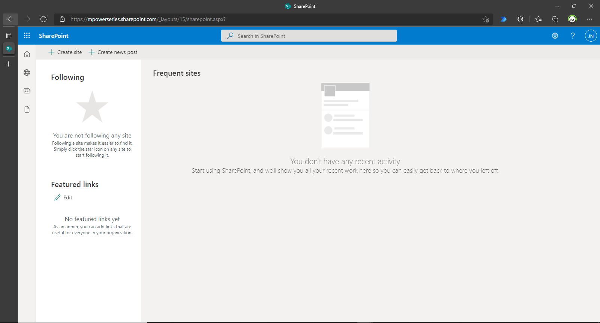
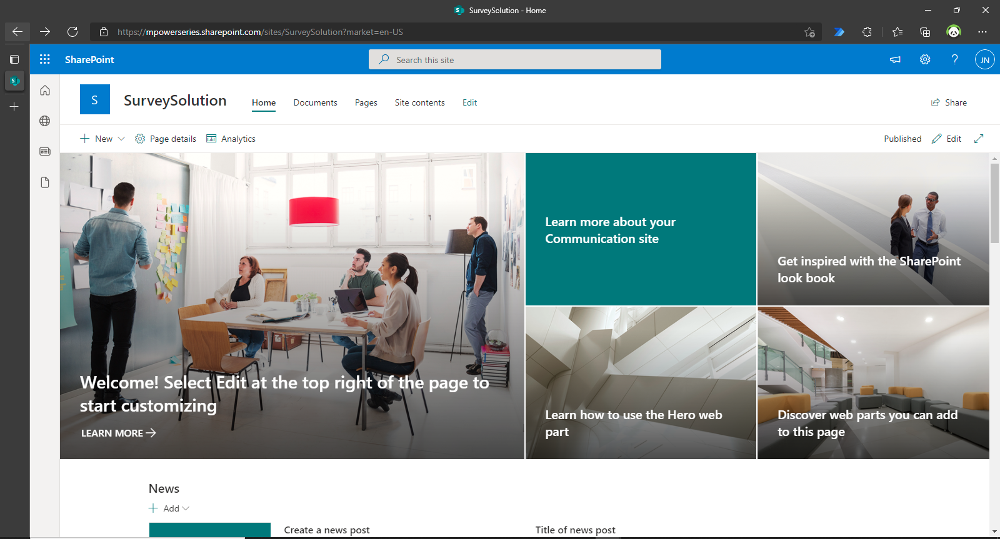
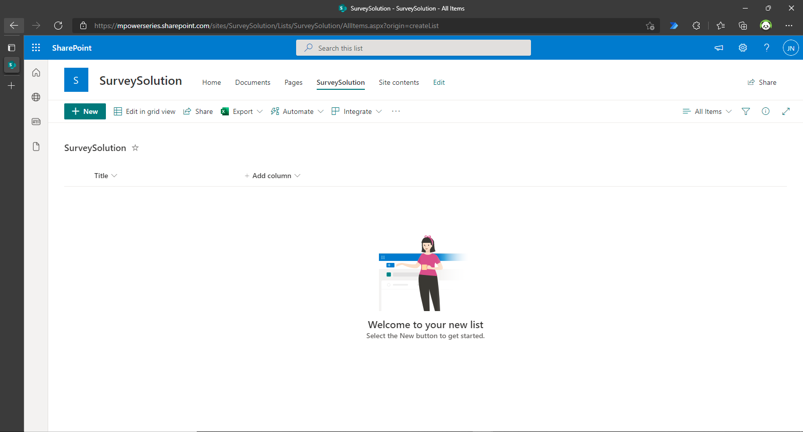
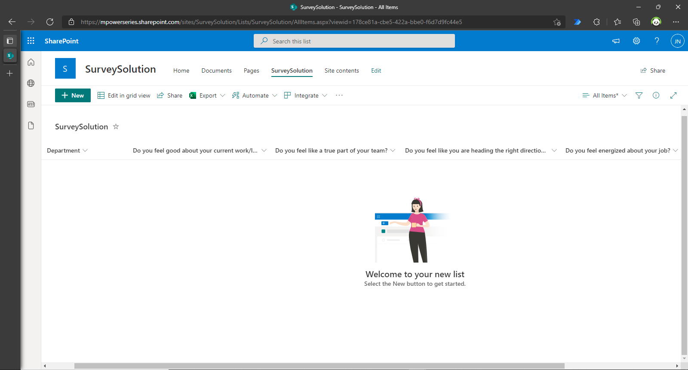

# Overview
Did you know that only 15% of employees worldwide are engaged with their work? The survey by [Smarp](https://blog.smarp.com/employee-engagement-8-statistics-you-need-to-know) also states that 71% of executives say that employee engagement is critical to their company's success. Employee engagement according to [BuiltIn](https://builtin.com/employee-engagement/how-to-improve-employee-engagement) is the degree to which employees are motivated by, passionate about and invested in the work they do.

Employee engagements goes beyond activities, games, and events. It is extent to which employees feel passionate about their jobs, are committed to the organization, and put discretionary effort into their work - [Custom Insight](https://www.custominsight.com/employee-engagement-survey/what-is-employee-engagement.asp)

The goal is to understand what needs to change within the organization. The following tool has been developed to allow you to embed surveys in your organization and get reviews from your employees at frequent intervals.

Microsoft's Power Platform can help make this happen. This sample showcases how you can integrate an automated employee review system in your organization using either Power Apps or Power Virtual Agents. Your automated system would share the survey with employees in your organization at the scheduled time and date, collect all responses, and upload them in real-time on SharePoint. From SharePoint, you can visualize the results to gain confirmed insights for growing your organization using Power BI.

In this sample, I would show you how to integrate this system into your organization's Teams tenant using either Power Apps or Power Virtual Agents and Power Automate. For this sample, we would be using the name "SurveySolution" to identify our solution.

# Prerequisites
In this sample, we would be using SharePoint for storing our data. SharePoint allows us
- Build intranet sites and create pages, document libraries, and lists.
- Manage daily routine with workflows, forms, and lists.
- Sync and store your files in the cloud so anyone can securely work with you.

SharePoint stores and displays information in form of a list. It is a collection of data that you can share with your team members and people to who you've provided access.

Throughout this sample, we would be making use of a SharePoint List. But first, we need to create a SharePoint site. If you have already created one, you just need to create a list to store information.

# Creating a SharePoint Site
There are two types of SharePoint sites:
- Team site enables team members to create and edit content and collaborate on projects, events, or ideas. They are restricted to people in your Microsoft 365 Group. Each member of the group has the same permissions.
- Communication site is relevant when you need to broadcast a message, tell a story, or share content for viewing to a larger audience in our organization. Behind the scene, just a few members are permitted to create and contribute to the content. In this sample, we would create a Communication Site.

- Head over to https://sharepoint.com and sign in with your Microsoft account.

- Click on '+ Create site' and select 'Communication site'.
- Give your site a name and add a description if you wish to at this point. Notice that as you type in the name of your site, it automatically creates a site address and confirms if it is available in your organization. You can also decide to pick another language convenient for you aside from English.
- When completed, click 'Finish'. The result is shown in the image below.

# Creating a SharePoint List
- Click on '+ New' and in the dropdown, click on 'List'.
- Click on 'Blank List' and give your SharePoint List a name. If you wish to, you can add a description or decide to leave that for later.
- Once you have completed this, click on 'Create'. You would be redirected to a new page that looks like the one in the image below.

# Populating our SharePoint List
Now it's time to populate our SharePoint list with the required columns for the solution we are building. But first, let's look at what our solution would look like.

In our survey, we want employees from different departments in our organization to anonymously tell us the state of things within their department. Their ratings on a scale of 0 to 5, 0 for lowest and 5 for highest is based on the following questions:
* Do you feel good about your current work/life balance?
* Do you feel like a true part of your team?
* Do you feel like you are heading in the right direction as a team?
* Do you feel energized about your job?

Our database needs to have a column for their department and each column for each question.

- To add the department column, click on the first column 'Title'. Go to 'Column Settings', then 'Rename', and change the name of the column from Title to Department.
- To add a column for each question, click on '+ Add Column', then 'Choice'. 
- In the sidebar that pops out fill in the following details:
* Name: Use each question as to the name of each column.
* Choices: Add 0 to 5 as the options. 
* Under 'More Options', change 'Display choices using' from Drop-Down Menu to Radio Buttons. Also, make sure the section 'Require that this column contains information' is toggled to Yes so employees do not skip any of the questions.
- Click on 'Save' to save the column.
- Replicate this process for the other questions. In the end, your SharePoint list should look like the one in the image below.

Now it's time to start developing an interface for our solution! The first 2 folders show how you can bring this to life as a Power Apps application for employees to interact with or as a virtual agent using Power Virtual Agents and Power Automate.

In either case, the response of each employee is automatically updated on our SharePoint List. The last folder shows us how we can visualize the response using either Power BI Online Service or Power BI Desktop.

TIME TO BRING THIS SOLUTION TO LIFE! 💃🏾 🕺🏾 - 👩🏾‍💻 👨🏾‍💻
